# Database Schema Diagram

This diagram acts as the true blueprint for the database engine. It maps the exact rules from the database constraints, including string lengths, nullability, unique constraints, and defaults.

```mermaid
%%{init: {
  "theme": "base",
  "themeVariables": {
    "primaryColor": "#ffffff",
    "primaryBorderColor": "#000000",
    "primaryTextColor": "#000000",
    "lineColor": "#000000",
    "tertiaryColor": "#ffffff",
    "fontFamily": "arial"
  }
}}%%
erDiagram
    STAFF {
        bigserial id PK
        varchar(255) name "NOT NULL"
        varchar(50) staff_role "NOT NULL"
        varchar(20) contact_no
        varchar(100) specialization
        boolean is_active "DEFAULT TRUE, NOT NULL"
        timestamp created_at "NOT NULL, UP"
        timestamp updated_at "NOT NULL"
    }

    USERS {
        bigserial id PK
        varchar(100) username "UK, NOT NULL"
        varchar(255) password_hash "NOT NULL"
        varchar(50) user_role "NOT NULL"
        bigint staff_id FK
        boolean is_active "DEFAULT TRUE, NOT NULL"
        timestamp created_at "NOT NULL, UP"
        timestamp updated_at "NOT NULL"
    }

    PATIENTS {
        bigserial id PK
        varchar(255) full_name "NOT NULL"
        integer age
        varchar(20) gender
        text address
        varchar(50) nic_passport_no "UK"
        varchar(100) contact_info
        timestamp created_at "NOT NULL, UP"
        timestamp updated_at "NOT NULL"
    }

    CASES {
        bigserial id PK
        varchar(50) case_number "UK, NOT NULL"
        varchar(20) case_type "NOT NULL"
        bigint patient_id FK "NOT NULL"
        date incident_date
        varchar(255) referring_authority
        varchar(50) referred_by
        varchar(50) case_status "DEFAULT 'OPEN', NOT NULL"
        bigint assigned_doctor_id FK
        timestamp created_at "NOT NULL, UP"
        timestamp updated_at "NOT NULL"
    }

    DOCUMENT_SERIAL_SEQUENCES {
        varchar(10) doc_type PK
        integer year PK
        integer last_seq "DEFAULT 0, NOT NULL"
    }

    MLEF {
        bigserial id PK
        varchar(30) mlef_number "UK"
        bigint case_id FK "UK, NOT NULL"
        bigint examining_doctor_id FK "NOT NULL"
        date date_of_issue
        date received_date
        varchar(255) referring_hospital
        varchar(255) referring_medical_officer
        varchar(255) police_station
        varchar(100) police_reference
        varchar(100) case_reference
        timestamp examination_date_time
        text nature_of_bodily_harm
        varchar(255) causative_weapon
        text alcohol_drug_test_results
        text findings
        varchar(50) report_status "NOT NULL"
        timestamp created_at "NOT NULL, UP"
        timestamp updated_at "NOT NULL"
    }

    MLR {
        bigserial id PK
        varchar(30) mlr_number "UK, NOT NULL"
        bigint case_id FK "UK, NOT NULL"
        bigint prepared_by FK "NOT NULL"
        date examination_date
        date date_finalized
        varchar(20) report_status "DEFAULT 'DRAFT', NOT NULL"
        varchar(500) digital_report_path
        timestamp created_at "NOT NULL, UP"
        timestamp updated_at "NOT NULL"
    }

    MLR_REVISIONS {
        bigserial id PK
        bigint mlr_id FK "NOT NULL"
        integer revision_number "NOT NULL"
        varchar(20) report_status_at_revision "NOT NULL"
        varchar(500) digital_report_path
        bigint revised_by FK
        text revision_reason
        timestamp created_at "NOT NULL, UP"
    }

    POSTMORTEM {
        bigserial id PK
        bigint case_id FK "UK, NOT NULL"
        bigint doctor_id FK "NOT NULL"
        varchar(100) inquest_order_ref
        date inquest_date
        varchar(255) place_of_pm
        varchar(100) cause_of_death_category
        text findings
        text cause_of_death
        timestamp created_at "NOT NULL, UP"
        timestamp updated_at "NOT NULL"
    }

    EVIDENCE {
        bigserial id PK
        varchar(30) evidence_number "UK"
        bigint case_id FK "NOT NULL"
        varchar(100) evidence_type "NOT NULL"
        text description "NOT NULL"
        varchar(255) storage_location
        bigint collected_by FK
        timestamp collected_at
        timestamp created_at "NOT NULL, UP"
        timestamp updated_at "NOT NULL"
    }

    EVIDENCE_CUSTODY_LOG {
        bigserial id PK
        bigint evidence_id FK "NOT NULL"
        bigint transferred_from FK
        bigint transferred_to FK
        timestamp transfer_timestamp "NOT NULL"
        text reason "NOT NULL"
        timestamp created_at "NOT NULL, UP"
    }

    LABORATORY_TESTS {
        bigserial id PK
        bigint case_id FK "NOT NULL"
        varchar(100) test_type "NOT NULL"
        bigint requested_by FK "NOT NULL"
        text result
        date result_date
        timestamp created_at "NOT NULL, UP"
        timestamp updated_at "NOT NULL"
    }

    COURT_REPORTS {
        bigserial id PK
        varchar(30) court_report_number "UK"
        bigint case_id FK "NOT NULL"
        varchar(20) report_type "NOT NULL"
        date submission_date
        date requested_date
        varchar(50) report_status "NOT NULL"
        varchar(255) court_name
        varchar(100) court_case_number
        date date_of_trial
        varchar(255) certificate_of_receipt_ref
        bigint prepared_by FK
        timestamp created_at "NOT NULL, UP"
        timestamp updated_at "NOT NULL"
    }

    DOCUMENTS {
        bigserial id PK
        varchar(50) owner_type "NOT NULL"
        bigint owner_id "NOT NULL"
        varchar(255) file_name "NOT NULL"
        varchar(50) file_type
        bigint file_size_bytes
        varchar(500) storage_path "NOT NULL"
        bigint uploaded_by FK "NOT NULL"
        timestamp uploaded_at "NOT NULL"
        timestamp created_at "NOT NULL, UP"
    }

    AUDIT_LOGS {
        bigserial id PK
        varchar(100) entity_name "NOT NULL"
        bigint entity_id "NOT NULL"
        varchar(50) action "NOT NULL"
        varchar(100) performed_by "NOT NULL"
        timestamp performed_at "NOT NULL"
        jsonb change_summary
    }

    NOTIFICATIONS {
        bigserial id PK
        varchar(50) notification_type "NOT NULL"
        bigint related_case_id FK
        bigint target_user_id FK "NOT NULL"
        text message "NOT NULL"
        varchar(50) notification_status "DEFAULT 'UNREAD', NOT NULL"
        timestamp created_at "NOT NULL, UP"
    }

    STAFF ||--o{ USERS : "has account"
    PATIENTS ||--o{ CASES : "is subject of"
    STAFF ||--o{ CASES : "assigned as doctor"
    CASES ||--o| MLEF : "has one MLEF"
    CASES ||--o| MLR : "has one MLR"
    MLR ||--o{ MLR_REVISIONS : "has version history"
    STAFF ||--o{ MLR : "prepared by"
    STAFF ||--o{ MLR_REVISIONS : "revised by"
    CASES ||--o| POSTMORTEM : "has one PM"
    STAFF ||--o{ MLEF : "examining doctor"
    STAFF ||--o{ POSTMORTEM : "pathologist"
    CASES ||--o{ EVIDENCE : "has evidence"
    STAFF ||--o{ EVIDENCE : "collected by"
    EVIDENCE ||--o{ EVIDENCE_CUSTODY_LOG : "custody chain"
    STAFF ||--o{ EVIDENCE_CUSTODY_LOG : "transferred from"
    STAFF ||--o{ EVIDENCE_CUSTODY_LOG : "transferred to"
    CASES ||--o{ LABORATORY_TESTS : "has lab tests"
    STAFF ||--o{ LABORATORY_TESTS : "requested by"
    CASES ||--o{ COURT_REPORTS : "has court reports"
    STAFF ||--o{ COURT_REPORTS : "prepared by"
    USERS ||--o{ DOCUMENTS : "uploaded by"
    CASES ||--o{ NOTIFICATIONS : "related case"
    USERS ||--o{ NOTIFICATIONS : "target user"
```

