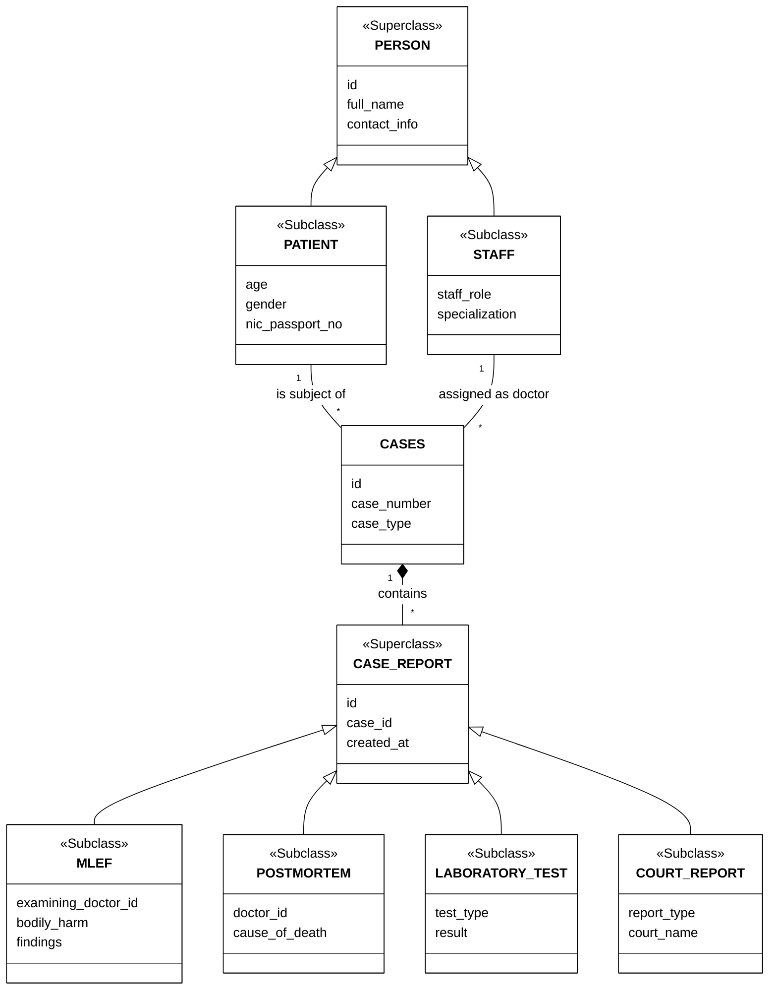

# Enhanced Entity-Relationship (EER) Diagram

This diagram visualizes the generalization, specialization, and inheritance hierarchies within the system. It groups common attributes into Superclasses (`PERSON` and `CASE_REPORT`) and leaves unique attributes in Subclasses.

