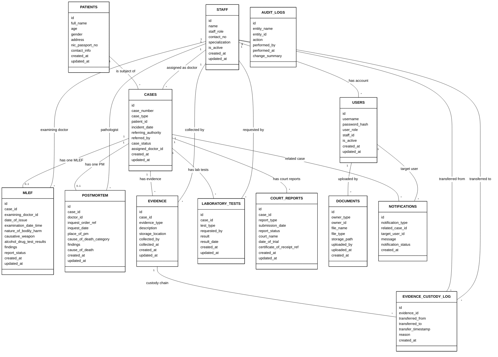

# Basic Entity-Relationship (ER) Diagram

This diagram represents the conceptual structure of the database. It focuses purely on the entities and their attributes, without specifying physical database constraints or SQL data types.

