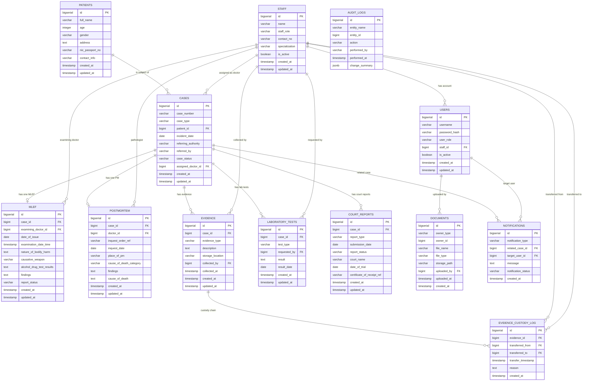

# Entity-Relationship Diagram

> Generated from the Flyway V1 schema. Relationships shown with cardinality notation.

```mermaid
erDiagram
    STAFF {
        bigserial id PK
        varchar name
        varchar staff_role
        varchar contact_no
        varchar specialization
        boolean is_active
        timestamp created_at
        timestamp updated_at
    }

    USERS {
        bigserial id PK
        varchar username
        varchar password_hash
        varchar user_role
        bigint staff_id FK
        boolean is_active
        timestamp created_at
        timestamp updated_at
    }

    PATIENTS {
        bigserial id PK
        varchar full_name
        integer age
        varchar gender
        text address
        varchar nic_passport_no
        varchar contact_info
        timestamp created_at
        timestamp updated_at
    }

    CASES {
        bigserial id PK
        varchar case_number
        varchar case_type
        bigint patient_id FK
        date incident_date
        varchar referring_authority
        varchar referred_by
        varchar case_status
        bigint assigned_doctor_id FK
        timestamp created_at
        timestamp updated_at
    }

    MLEF {
        bigserial id PK
        bigint case_id FK
        bigint examining_doctor_id FK
        date date_of_issue
        timestamp examination_date_time
        text nature_of_bodily_harm
        varchar causative_weapon
        text alcohol_drug_test_results
        text findings
        varchar report_status
        timestamp created_at
        timestamp updated_at
    }

    POSTMORTEM {
        bigserial id PK
        bigint case_id FK
        bigint doctor_id FK
        varchar inquest_order_ref
        date inquest_date
        varchar place_of_pm
        varchar cause_of_death_category
        text findings
        text cause_of_death
        timestamp created_at
        timestamp updated_at
    }

    EVIDENCE {
        bigserial id PK
        bigint case_id FK
        varchar evidence_type
        text description
        varchar storage_location
        bigint collected_by FK
        timestamp collected_at
        timestamp created_at
        timestamp updated_at
    }

    EVIDENCE_CUSTODY_LOG {
        bigserial id PK
        bigint evidence_id FK
        bigint transferred_from FK
        bigint transferred_to FK
        timestamp transfer_timestamp
        text reason
        timestamp created_at
    }

    LABORATORY_TESTS {
        bigserial id PK
        bigint case_id FK
        varchar test_type
        bigint requested_by FK
        text result
        date result_date
        timestamp created_at
        timestamp updated_at
    }

    COURT_REPORTS {
        bigserial id PK
        bigint case_id FK
        varchar report_type
        date submission_date
        varchar report_status
        varchar court_name
        date date_of_trial
        varchar certificate_of_receipt_ref
        timestamp created_at
        timestamp updated_at
    }

    DOCUMENTS {
        bigserial id PK
        varchar owner_type
        bigint owner_id
        varchar file_name
        varchar file_type
        varchar storage_path
        bigint uploaded_by FK
        timestamp uploaded_at
        timestamp created_at
    }

    AUDIT_LOGS {
        bigserial id PK
        varchar entity_name
        bigint entity_id
        varchar action
        varchar performed_by
        timestamp performed_at
        jsonb change_summary
    }

    NOTIFICATIONS {
        bigserial id PK
        varchar notification_type
        bigint related_case_id FK
        bigint target_user_id FK
        text message
        varchar notification_status
        timestamp created_at
    }

    %% Relationships
    STAFF ||--o{ USERS : "has account"
    PATIENTS ||--o{ CASES : "is subject of"
    STAFF ||--o{ CASES : "assigned as doctor"
    CASES ||--o| MLEF : "has one MLEF"
    CASES ||--o| POSTMORTEM : "has one PM"
    STAFF ||--o{ MLEF : "examining doctor"
    STAFF ||--o{ POSTMORTEM : "pathologist"
    CASES ||--o{ EVIDENCE : "has evidence"
    STAFF ||--o{ EVIDENCE : "collected by"
    EVIDENCE ||--o{ EVIDENCE_CUSTODY_LOG : "custody chain"
    STAFF ||--o{ EVIDENCE_CUSTODY_LOG : "transferred from"
    STAFF ||--o{ EVIDENCE_CUSTODY_LOG : "transferred to"
    CASES ||--o{ LABORATORY_TESTS : "has lab tests"
    STAFF ||--o{ LABORATORY_TESTS : "requested by"
    CASES ||--o{ COURT_REPORTS : "has court reports"
    USERS ||--o{ DOCUMENTS : "uploaded by"
    CASES ||--o{ NOTIFICATIONS : "related case"
    USERS ||--o{ NOTIFICATIONS : "target user"
```
